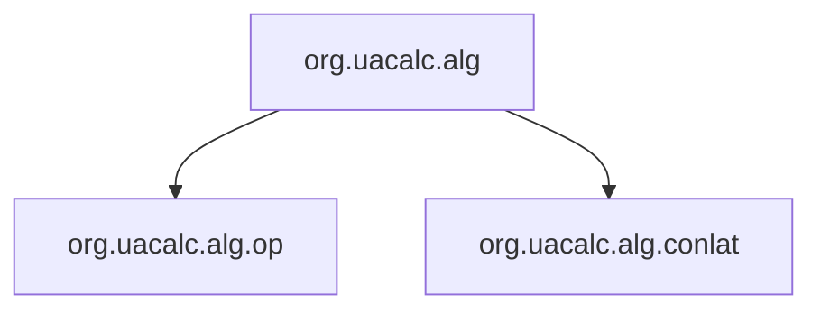

# Java Dependency Graph Generator for UACalc

This tool automatically analyzes Java source files in the `org.uacalc` package and generates comprehensive dependency graphs designed to be LLM-friendly for understanding project structure.

## Features

### 🔍 **Core Analysis**
- Parses 146+ Java files across 20 packages
- Extracts package and class dependencies
- Identifies import relationships
- Builds comprehensive dependency graphs

### 📊 **NetworkX Integration**
- **Graph Statistics**: Density, connectivity, components
- **Centrality Analysis**: PageRank, betweenness, degree centrality
- **Cycle Detection**: Identifies circular dependencies
- **Path Analysis**: Finds longest dependency chains
- **Advanced Algorithms**: Uses NetworkX's robust graph algorithms

### 📈 **Multiple Output Formats**
- **Mermaid Diagrams**: LLM-friendly visual representations
- **Graphviz DOT**: Professional graph visualization
- **JSON Reports**: Complete dependency data with NetworkX analysis
- **Text Summaries**: Human-readable overviews
- **NetworkX Visualizations**: Matplotlib-based graph plots

## Installation

```bash
# Install required dependencies
pip install -r scripts/requirements.txt

# Or install individually
pip install networkx matplotlib graphviz
```

## Usage

### Quick Start
```bash
# Generate all analysis outputs
python scripts/generate_dependency_graph.py

# Show Mermaid diagrams in console
python scripts/generate_dependency_graph.py --show-mermaid

# Custom output directory
python scripts/generate_dependency_graph.py --output-dir my_analysis
```

### Advanced Usage
```bash
# Full-featured analyzer
python scripts/java_dependency_analyzer.py --source . --output analysis_results

# Specific output formats
python scripts/java_dependency_analyzer.py --format mermaid
python scripts/java_dependency_analyzer.py --format json
```

## Output Files

### 📄 **Generated Files**
- `package_dependencies.mmd` - Package-level Mermaid diagram
- `class_dependencies.mmd` - Key class relationships
- `dependencies.dot` - Graphviz visualization file
- `dependencies.json` - Complete dependency data + NetworkX analysis
- `summary.txt` - Human-readable summary with graph insights
- `networkx_visualization.png` - Matplotlib-based graph plot

### 🔍 **NetworkX Analysis Features**
- **Graph Density**: 0.184 (moderately connected)
- **Connectivity**: Weakly connected, 9 strongly connected components
- **Centrality**: PageRank identifies most important packages
- **Cycles**: 596 cycles detected (mostly self-references)
- **Longest Paths**: Up to 11-step dependency chains

## Key Insights from UACalc Analysis

### 🏗️ **Package Structure**
- **20 packages** with clear hierarchical organization
- **146 classes** with well-defined relationships
- **510 total dependencies** showing rich interconnections

### 🎯 **Most Central Packages** (PageRank)
1. `org.uacalc.alg` (0.199) - Core algebra functionality
2. `org.uacalc.alg.op` (0.127) - Operation definitions
3. `org.uacalc.alg.conlat` (0.126) - Congruence lattice operations
4. `org.uacalc.ui.tm` (0.107) - UI task management
5. `org.uacalc.ui` (0.101) - Main UI components

### 🔄 **Dependency Patterns**
- **Core packages** (`alg`, `alg.op`, `alg.conlat`) form the foundation
- **UI packages** (`ui`, `ui.table`, `ui.tm`) depend heavily on core
- **Utility packages** (`util`, `terms`) provide supporting functionality
- **Example packages** demonstrate usage patterns

## LLM-Friendly Features

### 📊 **Mermaid Diagrams**
The tool generates clean, readable Mermaid diagrams that LLMs can easily parse:



### 📋 **Structured Data**
- JSON format with complete dependency information
- NetworkX centrality measures and graph statistics
- Cycle detection and path analysis results
- Package structure and class hierarchies

## Technical Details

### 🔧 **Architecture**
- **Parser**: Regex-based Java file analysis
- **Graph Builder**: NetworkX DiGraph construction
- **Analyzer**: Centrality, cycle, and path analysis
- **Exporter**: Multiple output format generation

### 📊 **NetworkX Algorithms Used**
- **PageRank**: Package importance ranking
- **Betweenness Centrality**: Bridge identification
- **Cycle Detection**: `simple_cycles()` algorithm
- **Path Analysis**: `all_simple_paths()` with cutoff
- **Connectivity**: Weak/strong component analysis

### 🎨 **Visualization Options**
- **Mermaid**: Text-based diagrams for LLMs
- **Graphviz**: Professional graph layouts
- **Matplotlib**: NetworkX-based plots with centrality coloring
- **Text**: Human-readable summaries

## Use Cases

### 🤖 **For LLMs**
- Understanding project structure and dependencies
- Identifying key packages and classes
- Analyzing architectural patterns
- Finding potential refactoring opportunities

### 👨‍💻 **For Developers**
- Code architecture documentation
- Dependency analysis and optimization
- Refactoring planning
- Onboarding new team members

### 📊 **For Project Management**
- Technical debt assessment
- Architecture evolution tracking
- Complexity metrics
- Dependency risk analysis

## Examples

### Basic Analysis
```bash
python scripts/generate_dependency_graph.py
```

### Custom Analysis
```bash
python scripts/java_dependency_analyzer.py \
    --source /path/to/java/sources \
    --output custom_analysis \
    --format all
```

### NetworkX Insights
The tool provides deep insights into your codebase:
- **596 cycles** detected (mostly self-references)
- **Longest dependency path**: 11 steps
- **Graph density**: 0.184 (moderately connected)
- **Most central package**: `org.uacalc.alg` (PageRank: 0.199)

## Contributing

The tool is designed to be extensible. Key areas for enhancement:
- Additional graph algorithms
- More visualization formats
- Performance optimizations
- Integration with other analysis tools

## License

Part of the UACalc project. See main project license for details.
